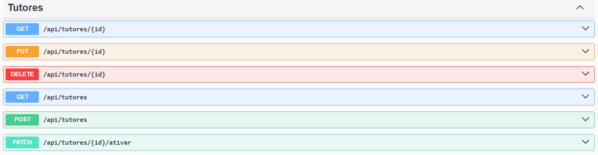
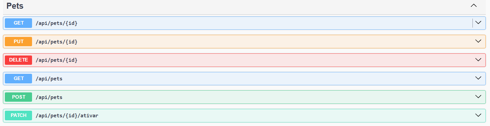
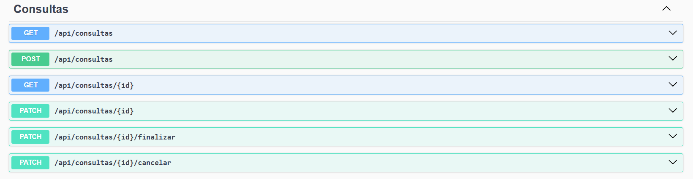
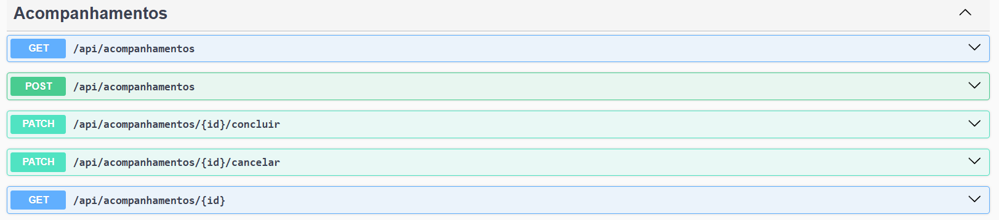
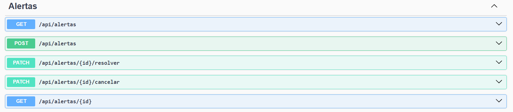
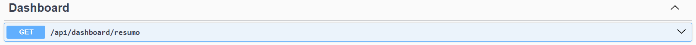
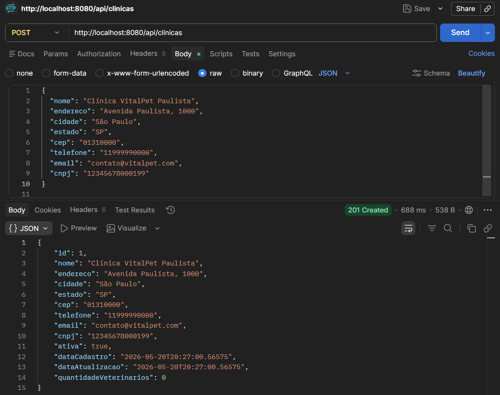
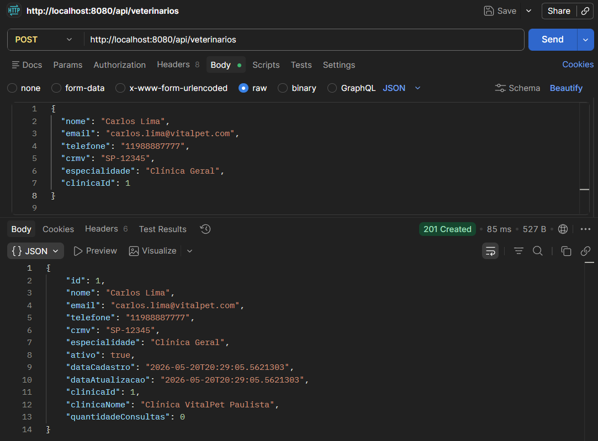
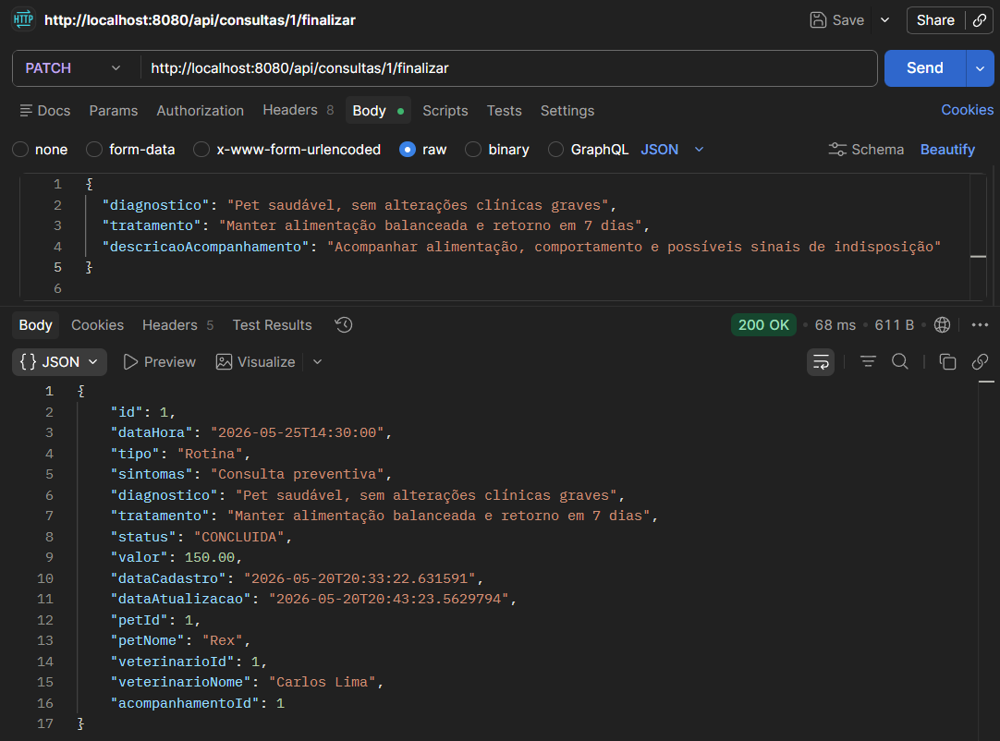

a# Clyvo VitalPet — Sprint 3 (Java Advanced)

Aplicação web em **Java 17 + Spring Boot**, desenvolvida para a entrega da Sprint 3 da disciplina **Java Advanced** (Challenge FIAP × Clyvo Vet).

A solução acompanha o pet **depois** da consulta: ao finalizar um atendimento, o sistema cria automaticamente um acompanhamento clínico e um alerta de retorno; ao resolver esse alerta, o acompanhamento é concluído junto. Toda a operação — clínicas, veterinários, tutores, pets, consultas, acompanhamentos e alertas — é gerenciada por uma aplicação web com login e permissões por perfil.

## Equipe

| Integrante | RM |
|---|---|
| João Victor Alcantara | RM562707 |
| Phillipo Barbosa | RM565399 |
| Eduardo Martins | RM562259 |

## Requisitos atendidos na Sprint 3 (Java Advanced)

| # | Requisito | Onde está |
|---|---|---|
| 1 | Camada de visualização (frontend) | Telas Thymeleaf em `src/main/resources/templates` — login, dashboard e CRUD completo de Clínicas, Veterinários, Tutores, Pets, Consultas e Alertas |
| 2 | Flyway para controle de versão do banco | `src/main/resources/db/migration` (`V1__create_schema.sql`, `V2__seed_data.sql`) |
| 3 | Spring Security — 2 perfis + proteção de rotas | `config/SecurityConfig.java`, perfis `ADMIN` e `VETERINARIO` (ver seção [Perfis e permissões](#perfis-e-permissões)) |
| 4 | 2 fluxos completos não-CRUD | Finalizar consulta → gera acompanhamento + alerta; Resolver alerta → conclui acompanhamento (ver [Fluxos de negócio](#fluxos-de-negócio-não-crud)) |

A API REST, o Swagger e a collection do Postman entregues em sprints anteriores continuam funcionando normalmente e sem autenticação (ver [API REST](#api-rest-swagger-e-postman)).

## Stack tecnológica

- Java 17
- Spring Boot 3.3.5 (Web, Data JPA, Validation, Cache, Security, Thymeleaf)
- Flyway (versionamento do schema)
- Thymeleaf + thymeleaf-extras-springsecurity6 (páginas condicionais por perfil)
- H2 Database
- Springdoc OpenAPI / Swagger
- Maven (com Maven Wrapper — não precisa ter o Maven instalado)

## Como executar localmente

Não é necessário ter o Maven instalado — o projeto inclui o Maven Wrapper.

```bash
./mvnw spring-boot:run
```

No Windows (PowerShell):

```powershell
.\mvnw.cmd spring-boot:run
```

Ao subir, o Flyway aplica automaticamente as migrations e popula o banco H2 em memória com dados de exemplo (2 clínicas, 3 veterinários, 3 tutores, 4 pets, 5 consultas em status variados, acompanhamentos, alertas e os 2 usuários de acesso). A aplicação sobe em:

```text
http://localhost:8080
```

## Acesso à aplicação web

Acesse **http://localhost:8080/web/login** e entre com um dos usuários já cadastrados na massa de dados:

| Perfil | E-mail | Senha |
|---|---|---|
| ADMIN | `admin@vitalpet.com.br` | `VitalPet@123` |
| VETERINARIO | `ana.souza@vitalpet.com.br` | `VitalPet@123` |

Após o login, o dashboard mostra os indicadores operacionais (clínicas/tutores/pets/veterinários ativos, consultas por status, alertas pendentes e faturamento) e o menu dá acesso às telas de CRUD.

## Perfis e permissões

| Área | ADMIN | VETERINARIO |
|---|---|---|
| Dashboard | ✅ | ✅ |
| Clínicas, Veterinários, Tutores | ✅ CRUD completo | 🚫 sem acesso (403) |
| Pets | ✅ CRUD completo | ✅ CRUD completo |
| Consultas | ✅ vê e gerencia todas | ✅ vê e gerencia **apenas as próprias** |
| Alertas | ✅ resolve/cancela qualquer alerta | ✅ resolve/cancela qualquer alerta |

Um usuário `VETERINARIO` só é criado vinculado a um registro de `Veterinario` existente (campo `veterinario_id` na tabela `usuarios`). Esse vínculo é o que restringe a listagem de consultas e trava o campo "veterinário" no formulário — tentar acessar a consulta de outro veterinário por link direto é bloqueado no `WebConsultaController`.

## Fluxos de negócio (não-CRUD)

### 1. Finalizar consulta → acompanhamento + alerta

Em **Consultas → Finalizar**, ao informar diagnóstico, tratamento e uma descrição de acompanhamento, o sistema:

1. Marca a consulta como `CONCLUIDA`;
2. Cria um `Acompanhamento` vinculado à consulta;
3. Cria um `Alerta` de retorno agendado para 7 dias depois.

### 2. Resolver alerta → conclui acompanhamento

Em **Alertas**, ao resolver um alerta vinculado a um acompanhamento ativo, o sistema conclui automaticamente esse acompanhamento (status `CONCLUIDO` + data de fim), fechando o ciclo de continuidade do cuidado.

## Testes automatizados

```bash
./mvnw test
```

Cobertura atual:

- `ClyvoVitalpetApplicationTests` — contexto sobe corretamente (Flyway + validação do schema pelo Hibernate).
- `SecurityConfigTest` — login obrigatório em `/web/**`, autorização por perfil (ADMIN x VETERINARIO) e confirmação de que a API REST continua aberta.
- `AlertaServiceTest` — resolução de alerta conclui o acompanhamento vinculado.

## API REST, Swagger e Postman

A API REST (`/api/**`) e o Swagger continuam **sem autenticação**, preservando os testes já documentados em sprints anteriores.

```text
http://localhost:8080/swagger-ui.html
```

### Principais endpoints

#### Clínicas

```text
POST   /api/clinicas
GET    /api/clinicas/{id}
GET    /api/clinicas?nome=vet&page=0&size=10&sortBy=nome&direction=asc
PUT    /api/clinicas/{id}
DELETE /api/clinicas/{id}
PATCH  /api/clinicas/{id}/ativar
```


#### Tutores

```text
POST   /api/tutores
GET    /api/tutores/{id}
GET    /api/tutores?nome=eduardo&cpf=12345678901&page=0&size=10
PUT    /api/tutores/{id}
DELETE /api/tutores/{id}
PATCH  /api/tutores/{id}/ativar
```


#### Pets

```text
POST   /api/pets
GET    /api/pets/{id}
GET    /api/pets?nome=thor&especie=cachorro&tutorId=1&page=0&size=10
PUT    /api/pets/{id}
DELETE /api/pets/{id}
PATCH  /api/pets/{id}/ativar
```


#### Veterinários

```text
POST   /api/veterinarios
GET    /api/veterinarios/{id}
GET    /api/veterinarios?especialidade=clinico&clinicaId=1&page=0&size=10
PUT    /api/veterinarios/{id}
DELETE /api/veterinarios/{id}
PATCH  /api/veterinarios/{id}/ativar
```


#### Consultas

```text
POST  /api/consultas
GET   /api/consultas/{id}
GET   /api/consultas?petId=1&status=AGENDADA&page=0&size=10&sortBy=dataHora&direction=desc
PATCH /api/consultas/{id}
PATCH /api/consultas/{id}/finalizar
PATCH /api/consultas/{id}/cancelar
```


Ao finalizar uma consulta com `descricaoAcompanhamento`, o sistema cria automaticamente um acompanhamento e um alerta de retorno para 7 dias depois — a mesma regra descrita em [Fluxos de negócio](#fluxos-de-negócio-não-crud), disponível tanto pela API quanto pela tela web.

#### Acompanhamentos

```text
POST  /api/acompanhamentos
GET   /api/acompanhamentos/{id}
GET   /api/acompanhamentos?petId=1&status=ATIVO&page=0&size=10
PATCH /api/acompanhamentos/{id}/concluir
PATCH /api/acompanhamentos/{id}/cancelar
```


#### Alertas

```text
POST  /api/alertas
GET   /api/alertas/{id}
GET   /api/alertas?petId=1&status=PENDENTE&prioridade=ALTA&page=0&size=10
PATCH /api/alertas/{id}/resolver
PATCH /api/alertas/{id}/cancelar
```


#### Dashboard

```text
GET /api/dashboard/resumo
```


### Ordem recomendada para os POSTs (Postman)

Algumas entidades dependem de outras já existentes no banco. Se preferir não usar a massa de dados do Flyway, a ordem recomendada para cadastrar do zero via API é:

```text
1. POST /api/clinicas
2. POST /api/veterinarios      (usa o id da clínica)
3. POST /api/tutores
4. POST /api/pets              (usa o id do tutor)
5. POST /api/consultas         (usa os ids de pet e veterinário)
6. PATCH /api/consultas/{id}/finalizar
7. GET  /api/acompanhamentos
8. GET  /api/alertas
9. GET  /api/dashboard/resumo
```

#### 1. Criar uma Clínica

```http
POST /api/clinicas
```

```json
{
  "nome": "Clínica VitalPet Paulista",
  "endereco": "Avenida Paulista, 1000",
  "cidade": "São Paulo",
  "estado": "SP",
  "cep": "01310000",
  "telefone": "11999990000",
  "email": "contato@vitalpet.com",
  "cnpj": "12345678000199"
}
```


#### 2. Criar um Veterinário

```http
POST /api/veterinarios
```

```json
{
  "nome": "Carlos Lima",
  "email": "carlos.lima@vitalpet.com",
  "telefone": "11988887777",
  "crmv": "SP-12345",
  "especialidade": "Clínica Geral",
  "clinicaId": 1
}
```


#### 3. Criar um Tutor

```http
POST /api/tutores
```

```json
{
  "nome": "João Pereira",
  "email": "joao.pereira@email.com",
  "telefone": "11977776666",
  "cpf": "12345678901",
  "endereco": "Rua das Flores, 200",
  "cidade": "São Paulo",
  "estado": "SP",
  "cep": "04000000"
}
```


#### 4. Criar um Pet

```http
POST /api/pets
```

```json
{
  "nome": "Rex",
  "especie": "Cachorro",
  "raca": "Golden Retriever",
  "dataNascimento": "2020-05-10",
  "sexo": "MACHO",
  "peso": 28.5,
  "observacoes": "Pet dócil e vacinado",
  "tutorId": 1
}
```


#### 5. Criar uma Consulta

```http
POST /api/consultas
```

```json
{
  "dataHora": "2026-05-25T14:30:00",
  "tipo": "Rotina",
  "sintomas": "Consulta preventiva",
  "valor": 150.00,
  "petId": 1,
  "veterinarioId": 1
}
```


#### 6. Finalizar a Consulta

```http
PATCH /api/consultas/1/finalizar
```

```json
{
  "diagnostico": "Pet saudável, sem alterações clínicas graves",
  "tratamento": "Manter alimentação balanceada e retorno em 7 dias",
  "descricaoAcompanhamento": "Acompanhar alimentação, comportamento e possíveis sinais de indisposição"
}
```


## Consultas no H2 Console

Com a aplicação rodando localmente (`./mvnw spring-boot:run`), o console fica em:

```text
http://localhost:8080/h2-console
```

```text
JDBC URL: jdbc:h2:mem:vitalpetdb
User: sa
Password: (deixe vazio)
```

```sql
SELECT * FROM CLINICAS;
SELECT * FROM TUTORES;
SELECT * FROM PETS;
SELECT * FROM VETERINARIOS;
SELECT * FROM CONSULTAS;
SELECT * FROM ACOMPANHAMENTOS;
SELECT * FROM ALERTAS;
SELECT * FROM USUARIOS;
```

> No profile `docker` (container separado para o banco), a URL de conexão é `jdbc:h2:tcp://localhost:1521/./vitalpetdb` — ver seção [Docker e Azure](#anexo-docker-e-azure-material-de-sprint-anterior) abaixo.

## Benefícios para o negócio

- Centralização dos dados de clínicas, tutores, pets, veterinários e consultas.
- Redução de perda de informações após o atendimento.
- Geração automática de acompanhamento e alerta de retorno ao final de cada consulta.
- Controle de acesso por perfil, isolando o que cada veterinário pode ver e alterar.
- Dashboard com indicadores para apoiar a gestão da clínica.

---

## Anexo: Docker e Azure (material de sprint anterior)

O conteúdo abaixo documenta a conteinerização e o deploy na Azure feitos na entrega de **DevOps Tools & Cloud Computing** de uma sprint anterior. Não faz parte dos requisitos da Sprint 3 de Java Advanced (que não exige nem restringe o uso de Docker), mas os scripts continuam funcionais e foram mantidos no repositório.

### Como executar localmente com Dockerfile

Na raiz do projeto, execute:

```bash
chmod +x scripts/run-containers-dockerfile.sh
./scripts/run-containers-dockerfile.sh
```

O script executa estes passos:

```bash
docker network create vitalpet-network
docker volume create vitalpet-h2-data
docker run -d --name vitalpet-h2 --network vitalpet-network -p 8082:81 -v vitalpet-h2-data:/opt/h2-data oscarfonts/h2:2.2.224
docker build -t vitalpet-api:1.0.0 .
docker run -d --name vitalpet-api --network vitalpet-network -p 8080:8080 vitalpet-api:1.0.0
```

Acesse:

```text
API:      http://localhost:8080
Swagger:  http://localhost:8080/swagger-ui.html
H2 Web:   http://localhost:8082
```

Configuração no H2 Console (profile Docker):

```text
JDBC URL: jdbc:h2:tcp://localhost:1521/./vitalpetdb
User: sa
Password: deixe vazio
```

Para verificar os containers:

```bash
docker ps
```

Para verificar o volume nomeado:

```bash
docker volume ls
```

Para comprovar que a aplicação não está rodando como root:

```bash
docker exec vitalpet-api whoami
```

Resultado esperado:

```text
appuser
```

Para parar os containers mantendo o volume do banco:

```bash
chmod +x scripts/stop-containers-dockerfile.sh
./scripts/stop-containers-dockerfile.sh
```

### Como executar na Azure

```bash
az login
chmod +x scripts/azure-vm-deploy.sh
./scripts/azure-vm-deploy.sh
```

O script irá:

1. Criar o Resource Group.
2. Criar uma VM Linux Ubuntu na Azure.
3. Abrir as portas 8080 e 8082.
4. Instalar Docker, Git, nano, curl e jq.
5. Clonar o projeto do GitHub.
6. Criar a rede Docker `vitalpet-network`.
7. Criar o volume nomeado `vitalpet-h2-data`.
8. Subir o container do banco H2.
9. Construir a imagem da API usando o Dockerfile.
10. Subir o container da API em background.

Ao final, o terminal exibirá:

```text
API:      http://IP_PUBLICO:8080
Swagger:  http://IP_PUBLICO:8080/swagger-ui.html
H2 Web:   http://IP_PUBLICO:8082
SSH:      ssh azureuser@IP_PUBLICO
```

### Remoção da VM

```bash
chmod +x scripts/delete-azure-resources.sh
./scripts/delete-azure-resources.sh
```

### Teste rápido do CRUD via script

```bash
chmod +x scripts/run-api-tests.sh
BASE_URL=http://localhost:8080 ./scripts/run-api-tests.sh
```

Na Azure, troque pelo IP público:

```bash
BASE_URL=http://IP_PUBLICO:8080 ./scripts/run-api-tests.sh
```

### Arquitetura macro (DevOps)

```text
docs/arquitetura-devops.mmd
```

```text
Usuário/Postman/Swagger -> IP público da VM -> Container Java Spring Boot -> Container H2 -> Volume nomeado
```
